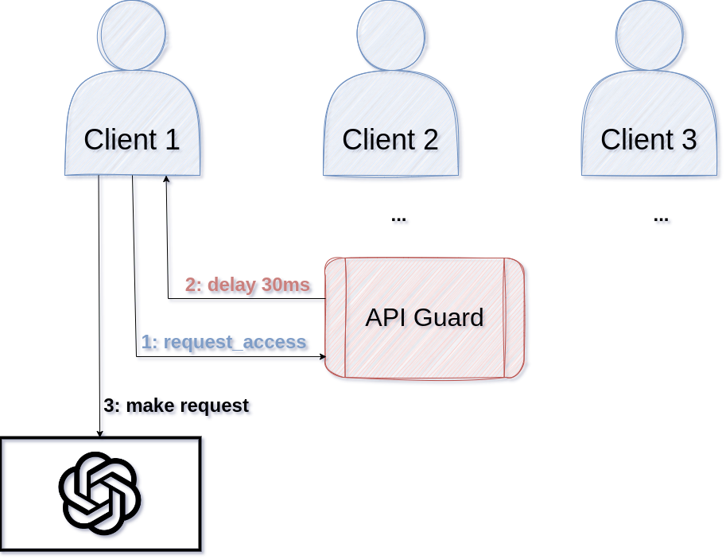

# ApiGuard

## Overview

ApiGuard is a rate limiting service designed to manage and protect API endpoints
from excessive use. It provides a flexible way to control the flow of requests,
ensuring APIs are used within predefined limits, thereby preventing overloading
and potential service disruptions.

**It tells clients how long they have to delay their requests or, optionally,
performs the delay for them.**

So, to integrate it with your clients, you only have to make one blocking http
request.

## Features

- **Rate Limiting**: Dynamically control the number of API requests allowed over
  a rolling 60-second window, supporting a constant minimum delay.
- **Flexible Configuration**: Adjust the rate limit and minimum delay on-the-fly
  as per your requirements.
- **Authentication**: Secure endpoints with token-based authentication to ensure
  only authorized modifications to rate limits.
- **Dual Delay Handling**: Choose between having the service handle request
  delays or providing delay information for client-side handling.



## Getting Started

### Prerequisites

- Python 3.x
- Flask
- python-dotenv

### Installation

1. Clone the repository:
   ```bash
   git clone https://github.com/nim-artificial-intelligence/api_guard.git
   ```
2. Navigate to the project directory:
   ```bash
   cd api_guard
   ```
3. Install the required packages:
   ```bash
   pip install -r requirements.txt
   ```

### Configuration

1. Create a `.env` file at `${XDG_CONFIG_HOME}/api_guard/.env` (which usually is: `~/.config/api_guard/.env`) with the following content:
   ```
   RATE_LIMIT=500
   PORT=5000
   AUTH_TOKEN=YourSecretAuthToken
   SLUG=/api_guard
   ```
   Note: the slug parameter is to add a prefix to the URL and is optional. If
   you use e.g. `SLUG=/api_guard`, your endpoint URLs change from
   `http://host:port/...` to `http://host:port/api_guard/...`. This makes it easier
   to add the service to an existing web server or deploy multiple instances of
   api_guard for different APIs.

2. Replace `YourSecretAuthToken` with your desired token.

Note that the minimum delay is initially set to: 

```python
request_default_delay = (60 / request_limit_per_60_seconds) * 0.25
```

For a rate limit of 500 (requests per minute), this works out to 30ms. You can
change it via a POST request at runtime. See below.

### Running the Service

Execute the following command to start the server:
```bash
python api_guard.py
```

### Running the Service in Production

1. Install gunicorn:
    ```bash
    pip install gunicorn
    ```
2. Add a LOGDIR to your `.env` file:
    ```
    LOGDIR=/path/to/some/dir
    ```
2. Start gunicorn:
    ```bash
    # read the .env file
    export $(cat "$XDG_CONFIG_HOME/api_guard/.env" | grep -v '^#' | xargs)
    # start gunicorn
    gunicorn -w 1 -b 0.0.0.0:$PORT --access-logfile $LOGDIR/access.log --error-logfile $LOGDIR/error.log api_guard:app
    ```

### Running the Service via Docker Container

1. Obtain the container from the download link you received (or build it
   yourself via `nix build .#docker`)
2. Load the image into docker:
    ```bash
    docker load < downloaded_file
    # or, if you build it with nix:
    docker load < result
    ```
3. Create an .env file, see [configuration](#configuration) and set its PORT to
   5000. That port is just used inside the container:
   ```
   PORT=5000
   LOGDIR=/tmp
   ```

4. Create a run directory and move the .env file there:
    ```bash
    mkdir rundir
    mv .env rundir/
    ```

4. Start the container (replace YOUR_PORT with the port you want):
    ```bash
    docker run -p YOUR_PORT:5000 -v $(realpath ./rundir):/tmp api_guard:latest

## Usage

### Endpoints

- **GET /request_access**
  - Params: `handle_delay` (boolean)
  - Headers: `Authorization: [Auth Token]`
  - Description: Request access for API usage, optionally handling delay server-side.
  - **Response**:
    - If `handle_delay` is `false` or not provided: Returns a JSON object with `delay_ms` indicating the number of milliseconds to wait before making the API request.
    - If `handle_delay` is `true`: Performs the delay server-side and returns a JSON object with `delay_ms` set to 0.

- **GET /get_rate_limit**
  - Headers: `Authorization: [Auth Token]`
  - Description: Retrieve the current rate limit.
  - **Response**:
    - Returns a JSON object with `current_rate_limit` showing the current rate limit value (number of requests allowed per 60 seconds).

- **POST /set_rate_limit**
  - Params: `new_limit` (integer), `default_delay` (integer) in milliseconds
  - Headers: `Authorization: [Auth Token]`
  - Description: Update the rate limit to a new value.
  - **Response**:
    - On success: Returns a JSON object with `success` set to `true` and `new_rate_limit` indicating the updated rate limit value.
    - On failure (e.g., invalid limit value or missing parameters): Returns a JSON object with `success` set to `false` and an `error` message detailing the issue.

### Example Responses

#### /request_access
- Success (with delay):
  ```json
  { "delay_ms": 500 }
  ```
- Success (without delay):
  ```json
  { "delay_ms": 0 }
  ```

#### /get_rate_limit
- Success:
  ```json
  { "current_rate_limit": 60, "default_delay": 30 }
  ```

#### /set_rate_limit
- Success:
  ```json
  { "success": true, "new_rate_limit": 80 }
  ```
- Failure:
  ```json
  { "success": false, "error": "Invalid rate limit value" }
  ```

## Contributing

Contributions are welcome! Submit a PR or send a patch file our way.

## License

This project is licensed under the [MIT License](LICENSE.md) - see the LICENSE file for details.
